# Diagramas — Administrador SOLAINO

Referencia visual del manual del administrador. Los diagramas usan [Mermaid](https://mermaid.js.org/); se renderizan en GitHub, GitLab, VS Code y muchas herramientas de documentación.

---

## 1. Contexto del sistema

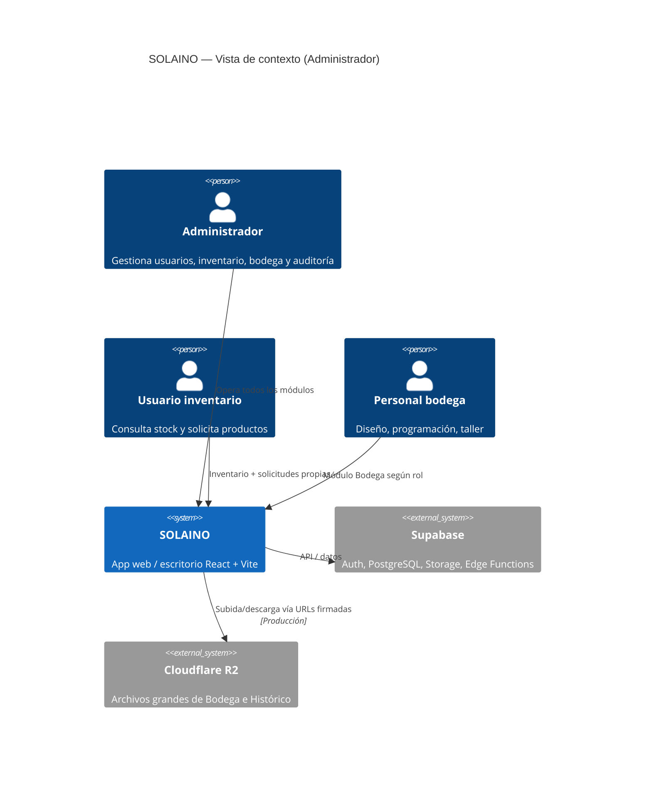

---

## 2. Casos de uso — Administrador

Actores principales y casos de uso **exclusivos o ampliados** para el administrador.

```mermaid
flowchart TB
  subgraph Actores
    ADM((Administrador))
    USR((Usuario inventario))
    ENC((Encargado bodega))
  end

  subgraph CU_Admin["Casos de uso — Administrador"]
    UC1[Gestionar usuarios]
    UC2[Asignar roles y contraseñas]
    UC3[Atender recuperación de contraseña]
    UC4[Consultar historial de auditoría]
    UC5[Limpiar historial por usuario]
    UC6[Administrar inventario completo]
    UC7[Gestionar solicitudes de producto]
    UC8[Operar módulo Bodega]
    UC9[Administrar catálogos Empresa / Requisitor]
    UC10[Revisar entregas de diseño]
    UC11[Exportar inventario CSV]
    UC12[Ver panel Inicio y contadores]
    UC13[Respaldo USB — Histórico]
    UC14[Gestionar plan de trabajo semanal]
  end

  subgraph CU_Otros["Compartidos con otros roles"]
    UC_E1[Registrar entradas/salidas]
    UC_E2[Gestionar proyectos y OC]
  end

  ADM --> UC1 & UC2 & UC3 & UC4 & UC5 & UC6 & UC7 & UC8 & UC9 & UC10 & UC11 & UC12 & UC13 & UC14
  ADM --> UC_E1 & UC_E2
  USR --> UC_E1
  ENC --> UC_E2 & UC10

  style CU_Admin fill:#eff6ff,stroke:#1d4ed8
  style CU_Otros fill:#f8fafc,stroke:#64748b
```

---

## 3. Mapa de navegación (Administrador)

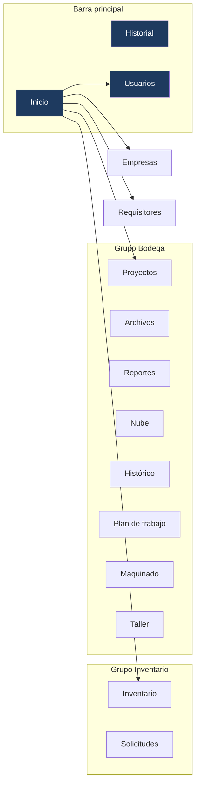

> **Nota:** El administrador **no** ve la vista «Prioridades» en el menú (reservada a diseñadora, programadora y operador). Sí tiene **Histórico**, **Plan de trabajo bodega**, Maquinado y Taller. La **campana de notificaciones** aparece junto al grupo Bodega.

---

## 4. Jerarquía de roles

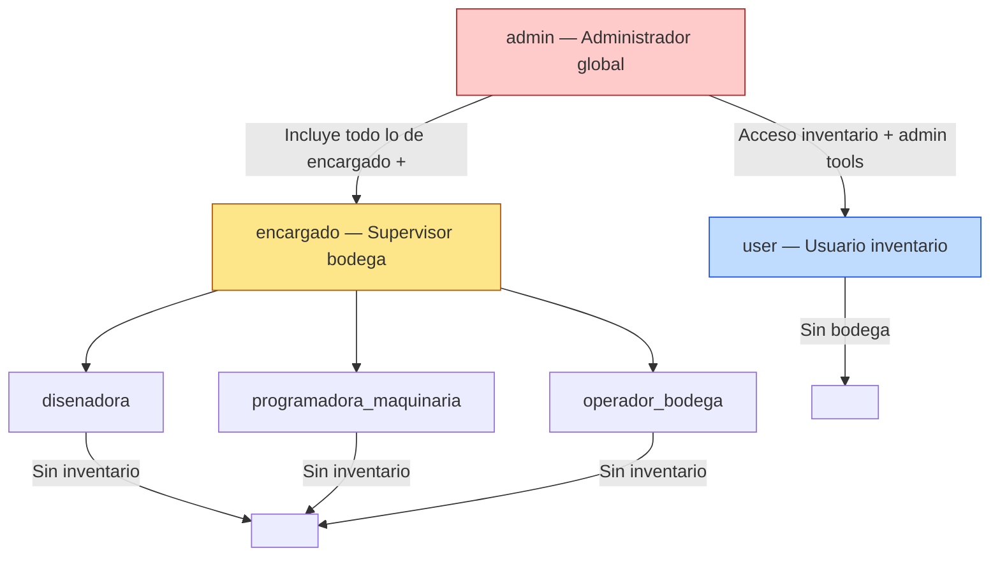

---

## 5. Flujo — Creación de usuario

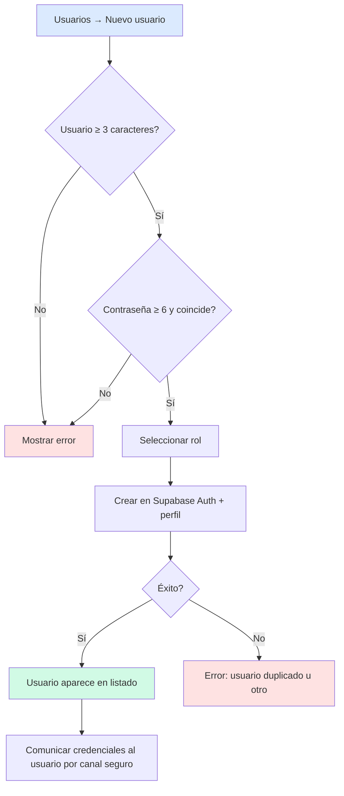

---

## 6. Flujo — Solicitud de producto (Administrador)

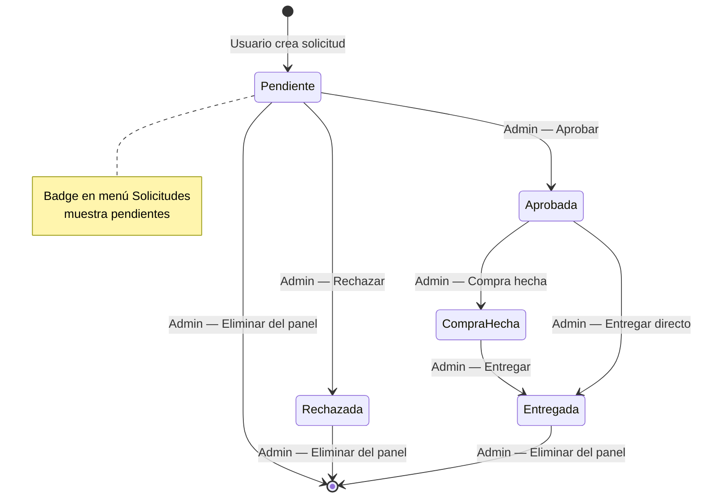

---

## 7. Flujo — Recuperación de contraseña

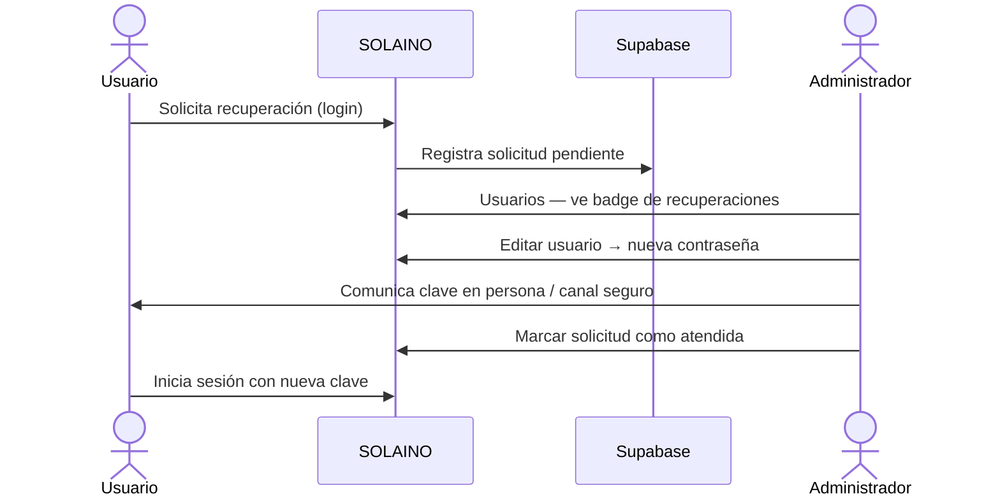

---

## 8. Flujo — Historial de auditoría

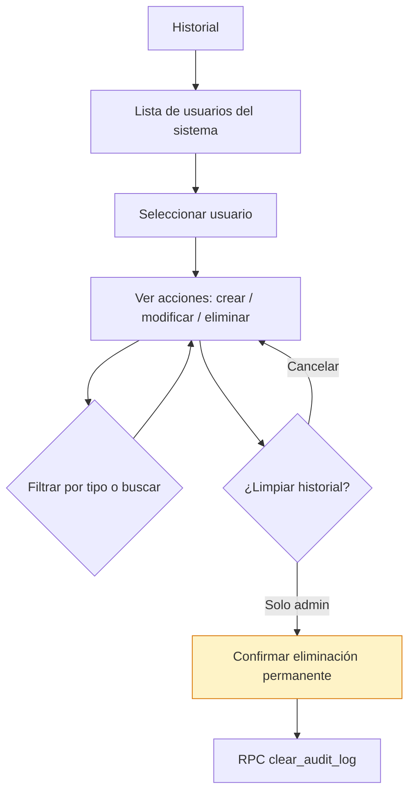

Acciones registradas incluyen, entre otras: producto creado/actualizado/eliminado, exportación CSV, solicitud creada/actualizada.

---

## 9. Ciclo de vida — Proyecto de Bodega (vista administrador)

El administrador puede intervenir en **todas** las etapas con permisos de supervisor.

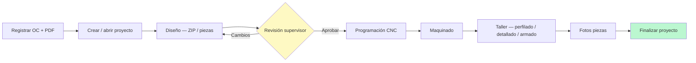

**Capacidades admin en este flujo:**

- Registrar órdenes de compra y PDF
- Creación masiva de proyectos desde partidas del PDF
- Asignar prioridad al proyecto
- Revisar y aprobar entregas de diseño (badge «!» en menú Bodega)
- Finalizar proyecto formalmente
- Consultar reportes de tiempos y contratiempos
- Explorar archivos en «Nube»
- Respaldo masivo USB en «Histórico» (diseño y programación)
- Sincronizar y exportar «Plan de trabajo bodega»

---

## 11. Flujo — Respaldo USB (Histórico)

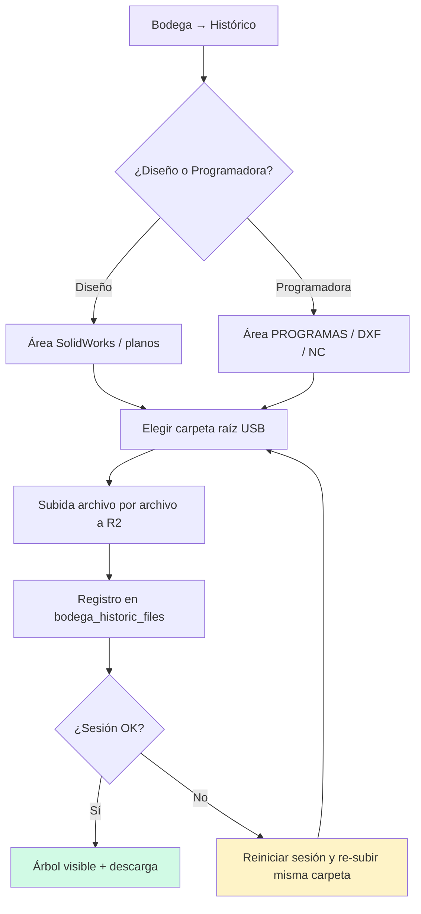

> Re-subir la **misma carpeta** no duplica: la ruta relativa es única por archivo.

---

## 12. Matriz de permisos (resumen)

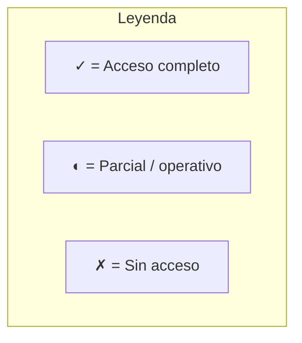

| Función | Admin | Encargado | Usuario | Diseñadora | Programadora | Operador |
|---------|:-----:|:---------:|:-------:|:----------:|:------------:|:--------:|
| Panel Inicio | ✓ | ✗ | ✗ | ✗ | ✗ | ✗ |
| Usuarios | ✓ | ✗ | ✗ | ✗ | ✗ | ✗ |
| Historial global | ✓ | ✗ | ✗ | ✗ | ✗ | ✗ |
| Inventario (CRUD) | ✓ | ✗ | ◐ | ✗ | ✗ | ✗ |
| Solicitudes (todas) | ✓ | ✗ | ◐ propias | ✗ | ✗ | ✗ |
| Bodega proyectos | ✓ | ✓ | ✗ | ◐ | ◐ | ◐ |
| Archivos diseño ref. | ✓ | ✓ | ✗ | ✗ | ✗ | ✗ |
| Reportes bodega | ✓ | ✓ | ✗ | ✓ | ✓ | ✗ |
| Nube (flujo activo) | ✓ | ✓ | ✗ | ◐ | ◐ | ◐ |
| Histórico (respaldo USB) | ✓ | ✓ | ✗ | ◐ | ◐ | ✗ |
| Plan de trabajo — editar/export | ✓ | ✓ | ✗ | ◐ ver | ◐ ver | ◐ ver |
| Prioridades (cola personal) | ✗ | ✗ | ✗ | ✓ | ✓ | ✓ |
| Empresas / Requisitores | ✓ | ✓ | ✗ | ✗ | ✗ | ✗ |

---

## 13. Arquitectura de datos (Administrador)

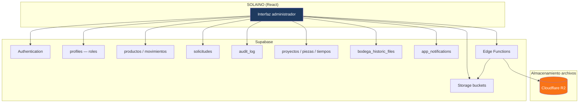

---

## 14. Flujo — Exportación CSV (Inventario)

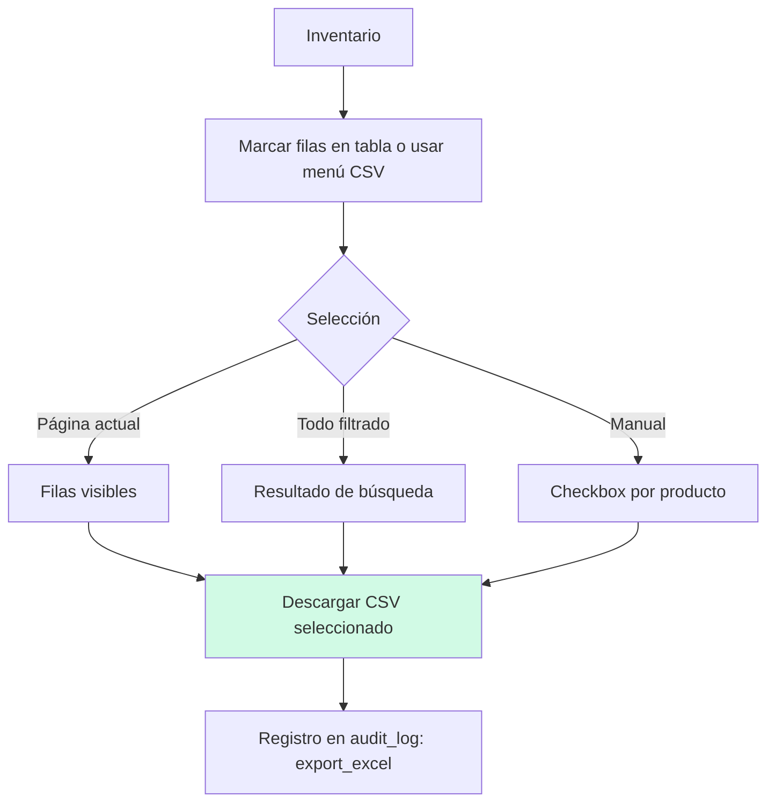

---

*Fin de diagramas — ver [MANUAL_ADMINISTRADOR.md](./MANUAL_ADMINISTRADOR.md) para procedimientos paso a paso.*
