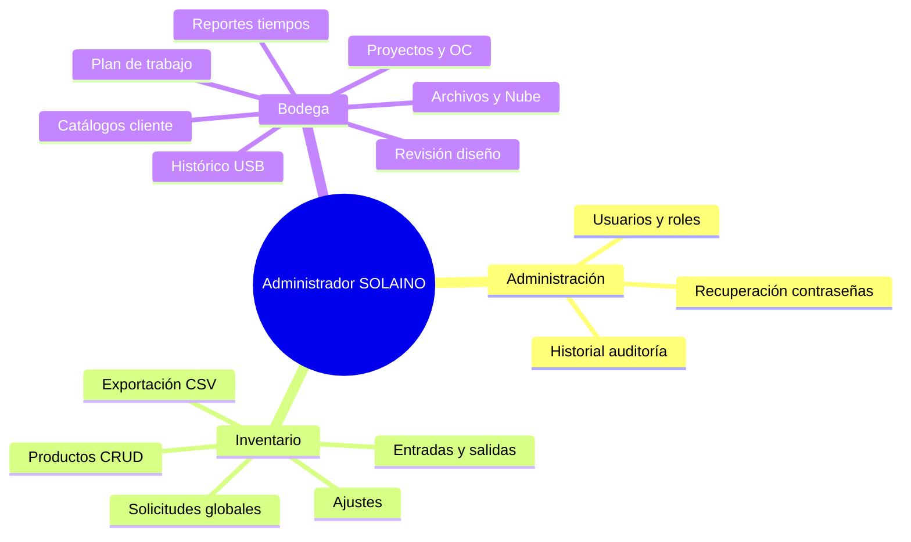
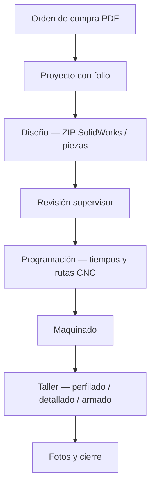

# Manual del Administrador — SOLAINO

**Sistema:** inventario-solaino (SOLAINO)  
**Rol:** `admin` — Administrador  
**Versión documento:** 1.1

---

## Tabla de contenidos

1. [Introducción](#1-introducción)
2. [Acceso al sistema](#2-acceso-al-sistema)
3. [Roles y diferencias](#3-roles-y-diferencias)
4. [Panel Inicio](#4-panel-inicio)
5. [Gestión de usuarios](#5-gestión-de-usuarios)
6. [Historial de auditoría](#6-historial-de-auditoría)
7. [Módulo Inventario](#7-módulo-inventario)
8. [Solicitudes de producto](#8-solicitudes-de-producto)
9. [Módulo Bodega](#9-módulo-bodega)
10. [Catálogos Empresas y Requisitores](#10-catálogos-empresas-y-requisitores)
11. [Indicadores y alertas](#11-indicadores-y-alertas)
12. [Buenas prácticas](#12-buenas-prácticas)
13. [Glosario](#13-glosario)
14. [Referencia técnica (TI)](#14-referencia-técnica-ti)

Diagramas visuales: [DIAGRAMAS.md](./DIAGRAMAS.md)

---

## 1. Introducción

SOLAINO integra dos áreas de negocio en una sola aplicación:

| Módulo | Propósito |
|--------|-----------|
| **Inventario** | Control de productos, entradas, salidas, embarques y solicitudes de material |
| **Bodega** | Seguimiento de proyectos de manufactura: diseño, programación CNC, maquinado, taller, tiempos y archivos |

El **Administrador** es el rol de mayor nivel. Puede operar ambos módulos y además gestionar cuentas, revisar auditoría y resolver solicitudes de todo el personal.

---

## 2. Acceso al sistema

### 2.1 Inicio de sesión

1. Abra la aplicación (navegador en desarrollo: `http://localhost:5273` o la URL de producción).
2. Ingrese **usuario** (nombre corto, sin `@`) o **correo** asociado a la cuenta.
3. Ingrese la **contraseña**.
4. Tras autenticarse, el sistema carga el perfil y determina el rol desde la tabla `profiles`.

### 2.2 Vista inicial

El administrador puede ver la barra de navegación con:

- **Inicio**, **Historial**, **Usuarios** (acceso exclusivo admin)
- Grupo **Inventario** → Inventario, Solicitudes
- Grupo **Bodega** → Proyectos, Archivos, Reportes, Nube, **Histórico**, **Plan de trabajo bodega**, Maquinado, Taller
- **Campana de notificaciones** junto al menú Bodega (avisos de cambio de prioridad en proyectos)

La última vista visitada puede recordarse por usuario en el navegador.

> El administrador **no** ve la vista **Prioridades** en el menú (cola personal de diseñadora, programadora y operador). Sí puede cambiar la prioridad de un proyecto desde **Proyectos** o **Archivos** y gestionar el **Plan de trabajo bodega**.

### 2.3 Barra superior

Muestra el usuario conectado y permite **cerrar sesión**. Mantenga la sesión privada en equipos compartidos.

---

## 3. Roles y diferencias

El sistema define seis roles operativos:

| Rol interno | Nombre en pantalla | Ámbito principal |
|-------------|-------------------|------------------|
| `admin` | Administrador | Todo el sistema |
| `user` | Usuario | Solo inventario |
| `encargado` | Supervisor / encargado (Bodega) | Bodega + catálogos (sin Usuarios/Historial/Solicitudes globales) |
| `disenadora` | Diseñadora (Bodega) | Diseño y piezas |
| `programadora_maquinaria` | Programadora maquinaria | Programación, maquinado, taller |
| `operador_bodega` | Operador taller | Maquinado y etapas de taller |

### 3.1 Administrador vs Encargado

| Capacidad | Admin | Encargado |
|-----------|:-----:|:---------:|
| Panel Inicio | ✓ | ✗ |
| Usuarios | ✓ | ✗ |
| Historial global | ✓ | ✗ |
| Limpiar auditoría | ✓ | ✗ |
| Solicitudes (todas) | ✓ | ✗ |
| Inventario completo | ✓ | ✗ |
| Bodega operativa | ✓ | ✓ |
| Empresas / Requisitores | ✓ | ✓ |
| Revisión entregas diseño | ✓ | ✓ |
| Finalizar proyecto | ✓ | ✓ |
| Histórico (ambas áreas) | ✓ | ✓ |
| Plan de trabajo — editar / exportar | ✓ | ✓ |
| Eliminar archivos del Histórico | ✓ | ✓ |

> El encargado es supervisor de **bodega**, no administrador global. Solo el admin gestiona cuentas y solicitudes de inventario de terceros.

---

## 4. Panel Inicio

**Ruta de navegación:** barra principal → **Inicio**

### 4.1 Contenido

El panel muestra:

- Nombre del administrador conectado
- Rol y fecha/hora de entrada a la sesión
- Tarjetas de acceso rápido a módulos y contadores

### 4.2 Tarjetas y contadores

| Tarjeta | Acción al hacer clic | Contador |
|---------|----------------------|----------|
| Inventario | Ir a módulo Inventario | — |
| Bodega | Ir a Proyectos | — |
| Usuarios registrados | Ir a Usuarios | Total perfiles |
| Clientes (empresa) | Ir a catálogo Empresas | Total empresas |
| Requisitor (clientes) | Ir a catálogo Requisitores | Total requisitores |
| Cotizaciones | — | Próximamente (sin tabla activa) |

Use este panel como **punto de control diario** antes de entrar a tareas operativas.

---

## 5. Gestión de usuarios

**Ruta:** barra principal → **Usuarios**

### 5.1 Listado

- Tabla paginada de cuentas con usuario, correo, rol y fecha de alta
- Búsqueda por usuario, correo, rol o ID
- Botón **Recargar** para actualizar datos

### 5.2 Crear usuario

1. Clic en **Nuevo usuario**
2. Complete:
   - **Usuario:** mínimo 3 caracteres (se normaliza a minúsculas)
   - **Rol:** seleccione según la función del personal
   - **Contraseña** y **confirmación:** mínimo 6 caracteres
3. Confirme la creación
4. Comunique al usuario su usuario y contraseña por un **canal seguro** (presencial, teléfono interno, etc.)

El sistema crea la cuenta en Supabase Authentication y el perfil con el rol elegido.

### 5.3 Editar usuario

Desde el icono de edición en una fila:

| Campo | Descripción |
|-------|-------------|
| Usuario | Cambiar nombre de login (sincroniza correo interno de auth) |
| Rol | Cambiar permisos del sistema |
| Nueva contraseña | Opcional; requiere confirmación y aviso al usuario |

**Restricción:** no puede eliminar su propia cuenta mientras está conectado con ese usuario.

### 5.4 Eliminar usuario

1. Icono eliminar en la fila (no disponible sobre su propia cuenta)
2. Confirmar en el diálogo — **acción irreversible**
3. Se elimina la cuenta en Authentication y el perfil asociado

### 5.5 Recuperación de contraseña

Sección destacada en amarillo dentro de Usuarios:

1. Los usuarios pueden registrar una solicitud desde la pantalla de login
2. El administrador ve la lista con usuario y fecha
3. Procedimiento recomendado:
   - Editar usuario → establecer nueva contraseña
   - Comunicar la clave al usuario
   - Clic en **Marcar atendida** en la solicitud

Un **badge numérico** en el menú Usuarios indica solicitudes pendientes de recuperación.

### 5.6 Guía rápida de asignación de roles

| Si la persona… | Rol recomendado |
|----------------|-----------------|
| Gestiona todo el sistema | `admin` |
| Solo pide material del almacén | `user` |
| Supervisa bodega y OC | `encargado` |
| Entrega diseños y piezas | `disenadora` |
| Programa CNC y tiempos | `programadora_maquinaria` |
| Opera torno/CNC y taller | `operador_bodega` |

---

## 6. Historial de auditoría

**Ruta:** barra principal → **Historial**

Herramienta de **supervisión y cumplimiento** sobre acciones en inventario (y otras registradas en `audit_log`).

### 6.1 Uso

1. Se muestra el listado de usuarios del sistema
2. Seleccione un usuario para abrir su bitácora
3. Filtre por tipo: **Crear**, **Modificar**, **Eliminar**, **Otro**
4. Use la búsqueda por texto libre (acción, entidad, código producto, fecha)

### 6.2 Acciones registradas (ejemplos)

| Código interno | Descripción en pantalla |
|----------------|-------------------------|
| `producto_creado` | Agregó producto |
| `producto_actualizado` | Editó producto |
| `producto_eliminado` | Elimió producto |
| `export_excel` | Exportó Excel/CSV |
| `solicitud_creada` | Solicitud creada |
| `solicitud_actualizada` | Solicitud actualizada |

### 6.3 Limpiar historial

Solo el **administrador** puede eliminar permanentemente toda la auditoría de un usuario seleccionado.

- Use esta función con criterio legal/operativo
- Requiere confirmación explícita
- **No se puede deshacer**

---

## 7. Módulo Inventario

**Ruta:** Inventario → **Inventario**

### 7.1 Capacidades exclusivas del admin

Frente al usuario normal (`user`), el administrador además puede:

- **Crear** productos nuevos
- **Editar** cualquier campo del producto (incl. inline en tabla)
- **Eliminar** productos
- **Ajuste inventario** (corrección de stock)

Todos los roles con acceso a inventario pueden registrar **entradas** y **embarques/salidas**.

### 7.2 Acciones principales

| Botón | Función |
|-------|---------|
| Ajuste inventario | Corrección administrativa de existencias |
| Entradas producto | Alta de mercancía al stock |
| Embarque / salida | Registro de salida |
| Opciones exportación CSV | Seleccionar filas y descargar reporte |

### 7.3 Tabla de productos

Por cada fila el admin dispone de:

- **Editar** — formulario completo
- **Eliminar** — con confirmación
- **Historial** — movimientos del producto (entradas/salidas)
- Edición rápida de campos permitidos

### 7.4 Exportación CSV

1. Marque productos con el checkbox o use el menú «Opciones exportación CSV»
2. Opciones: página actual, todo el filtrado, limpiar selección
3. Descargue **CSV seleccionado** (UTF-8 con BOM, separador `;`)
4. La acción queda registrada en auditoría

### 7.5 Búsqueda y paginación

Use el campo de búsqueda para filtrar por código, nombre u otros campos visibles. La paginación controla cuántas filas se muestran por página.

---

## 8. Solicitudes de producto

**Ruta:** Inventario → **Solicitudes**

> **Exclusivo del administrador:** ver y gestionar solicitudes de **todos** los usuarios.

### 8.1 Estados

| Estado | Significado |
|--------|-------------|
| Pendiente | Esperando decisión del administrador |
| Aprobada | Autorizada; procede compra/entrega |
| Rechazada | No procede |
| Entregada | Material surtido al solicitante |

Estados intermedios de compra pueden reflejarse vía acción **Compra hecha**.

### 8.2 Acciones por fila (menú Acciones)

| Acción | Efecto |
|--------|--------|
| Compra hecha | Indica que ya se compró el material |
| Aprobar | Pasa a aprobada |
| Entregar | Registra entrega / surtido |
| Rechazar | Rechaza la solicitud |
| Eliminar del panel | Quita la fila del listado |

### 8.3 Badge de pendientes

El número junto a **Solicitudes** en el menú indica cuántas solicitudes están pendientes. Se actualiza periódicamente mientras la sesión admin está activa.

---

## 9. Módulo Bodega

El administrador tiene **acceso completo** a bodega con permisos equivalentes al supervisor (encargado), más visibilidad global.

### 9.1 Proyectos

**Ruta:** Bodega → **Proyectos**

Flujo general de un proyecto:

**Acciones destacadas del admin:**

- Registrar **orden de compra** y subir PDF
- **Crear proyectos** manualmente o en lote desde partidas del PDF de OC
- Asignar **prioridad** (0–4) al proyecto — diseñadora, programadora y operador reciben **aviso** en la campana de notificaciones
- **Revisar entregas** de diseño pendientes (icono **!** junto al menú Bodega)
- Aprobar o pedir cambios en versiones de diseño
- Intervenir en programación, maquinado y taller cuando sea necesario
- **Finalizar proyecto** tras completar fotos y validaciones
- Guardar **notas** en el historial del proyecto (con rol visible)

### 9.2 Archivos (referencia diseño)

**Ruta:** Bodega → **Archivos**

- Subir ZIP de **referencia del cliente** para la diseñadora
- Compartido con encargado; diseñadora consume desde su flujo de proyecto

### 9.3 Reportes

**Ruta:** Bodega → **Reportes**

- Tiempos por orden de compra y proyecto
- Contratiempos y notas
- Exportación PDF de reportes
- Historial de actividad por proyecto

### 9.4 Nube

**Ruta:** Bodega → **Nube**

- Explorador de archivos subidos en el flujo de bodega (por rutas de storage)
- Renombrar/mover archivos (según permisos)
- Visibilidad de lo que cada área adjuntó

### 9.5 Histórico

**Ruta:** Bodega → **Histórico**

Respaldo de carpetas de la USB (diseño y programación) y consulta de archivos del flujo de bodega. Los archivos grandes se guardan en **Cloudflare R2** cuando está activo (`VITE_USE_R2_STORAGE=1`).

#### Áreas (selector superior)

El administrador ve **dos botones**:

| Botón en pantalla | Contenido típico | Uso |
|-------------------|-----------------|-----|
| **Programadora** | PROGRAMAS, DXF, NC, carpetas de la USB de programación | Respaldo CNC |
| **Diseño** | SolidWorks, planos, carpetas como SOLAINO | Respaldo diseño |

#### Pestañas

| Pestaña | Función |
|---------|---------|
| **Archivo histórico** | Subir carpeta completa de USB o archivo suelto; explorar en árbol |
| **Del flujo (Nube)** | Solo lectura — archivos que el personal subió en proyectos activos |

#### Subir carpeta de USB (procedimiento recomendado)

1. Elija el área correcta (**Diseño** o **Programadora**).
2. Clic en **Elegir carpeta de la USB…** y seleccione la **carpeta raíz** (ej. `SOLAINO` o `PROGRAMAS JCP`).
3. Espere a que termine el contador (`Subiendo X / Y`). **No cierre sesión** ni recargue la página durante subidas grandes.
4. Si se interrumpe por sesión, **vuelva a iniciar sesión** y suba **la misma carpeta** — los archivos ya guardados **no se duplican** (misma ruta = actualización).
5. Pulse **Actualizar** para ver el total en el árbol.

#### Permisos del admin

- Subir y consultar **ambas** áreas
- **Eliminar** registros del histórico (también encargado)
- Ver todo el árbol sin restricción por rol

> **Nota para diseñadora / programadora:** cada rol solo ve y sube en su área asignada. El admin centraliza respaldos masivos desde USB.

### 9.6 Plan de trabajo bodega

**Ruta:** Bodega → **Plan de trabajo bodega**

Tablero semanal de seguimiento de proyectos (metas por etapa, entregas, atrasos).

| Acción | Admin / Encargado | Otros roles |
|--------|:-----------------:|:-----------:|
| Ver plan de la semana | ✓ | ✓ |
| Agregar / editar filas | ✓ | ✗ |
| Sincronizar desde prioridades | ✓ | ✗ |
| Registrar motivo de atraso | ✓ | ✗ |
| Exportar Excel / PDF | ✓ | ✗ |
| Copiar resumen (texto) | ✓ | ✓ |

**Flujo típico del administrador:**

1. Asigne **prioridades** en Proyectos o Archivos.
2. En Plan de trabajo → **Sincronizar desde prioridades** para traer proyectos a la semana actual.
3. Revise columnas de avance planificado vs real (diseño, programación, maquinado, etc.).
4. Marque **Motivo** en filas con atraso.
5. **Exporte** Excel o PDF para juntas de supervisión (solo admin y encargado).

Use la **vista proyector** (pantalla completa) en reuniones de planta si está disponible en la barra del plan.

### 9.7 Maquinado

**Ruta:** Bodega → **Maquinado**

- Cola global de piezas listas para CNC/Torno
- Registro de tiempos reales y hojas de tiempo

### 9.8 Taller

**Ruta:** Bodega → **Taller**

- Colas de perfilado, detallado y armado
- Cronómetros por pieza y etapa

### 9.9 Lo que el admin NO ve en menú

La vista **Prioridades** (cola de trabajo personalizada) está orientada a diseñadora, programadora y operador. El admin accede a proyectos desde **Proyectos** o **Maquinado/Taller**.

---

## 10. Catálogos Empresas y Requisitores

Acceso desde tarjetas del **Panel Inicio** (también disponible para encargado desde su navegación).

### 10.1 Empresas (clientes)

- Listado de empresas cliente
- **Agregar**, **editar nombre**, **eliminar**
- Los nombres se normalizan a mayúsculas sin espacios extra
- Se usan al vincular proyectos de bodega

### 10.2 Requisitores

- Catálogo de personas o áreas que requisitan
- Misma mecánica CRUD que empresas
- Referencia en flujos de OC y proyectos

---

## 11. Indicadores y alertas

| Indicador | Ubicación | Significado |
|-----------|-----------|-------------|
| Badge Solicitudes | Menú Inventario → Solicitudes | Solicitudes pendientes |
| Badge Usuarios | Menú Usuarios | Recuperaciones de contraseña pendientes |
| Badge Bodega «!» | Junto al grupo Bodega | Entregas de diseño/programación por revisar |
| Campana notificaciones | Junto al menú Bodega | Cambios de prioridad en proyectos (para personal operativo; admin la ve si tiene avisos propios) |
| Contadores Inicio | Panel Inicio | Totales de usuarios, empresas, requisitores |

Revise estos indicadores al iniciar la jornada.

---

## 12. Buenas prácticas

### Seguridad

- No comparta la cuenta admin; cree usuarios individuales por persona
- Asigne el rol mínimo necesario (principio de menor privilegio)
- Cambie contraseñas por canal privado; no por correo no cifrado si contiene credenciales
- Cierre sesión al terminar en equipos compartidos

### Operación

- Resuelva solicitudes de inventario en orden de antigüedad cuando sea posible
- Documente rechazos comunicando al usuario fuera del sistema si hace falta
- En bodega, use **notas** del proyecto para dejar trazabilidad con rol identificado
- Antes de **finalizar** un proyecto, verifique fotos y tiempos en reportes
- Para respaldos USB masivos use **Histórico**; no suba carpetas enteras solo por **Nube** (Nube lista lo del flujo activo)
- En subidas largas al Histórico, mantenga la sesión abierta; si falla, reintente con la **misma carpeta**

### Auditoría

- Consulte Historial ante discrepancias de stock
- Evite limpiar auditoría salvo política expresa de retención de datos

---

## 13. Glosario

| Término | Definición |
|---------|------------|
| **OC** | Orden de compra — documento PDF asociado a uno o más proyectos |
| **Folio** | Identificador del proyecto en bodega |
| **Entrega (diseño)** | Versión ZIP subida por diseñadora; puede requerir revisión del supervisor |
| **Pieza** | Componente dentro de un ensamble/proyecto |
| **Perfil** | Registro en `profiles` con rol y datos de login |
| **Auditoría** | Registro inmutable de acciones (`audit_log`) consultable por usuario |
| **Solicitud** | Petición de material del inventario hecha por un usuario |
| **Nube** | Vista de archivos almacenados en el flujo activo de bodega (por proyecto/pieza) |
| **Histórico** | Respaldo de carpetas USB (diseño/programación) indexado en `bodega_historic_files` |
| **Plan de trabajo** | Tablero semanal de metas y avance por proyecto |
| **R2** | Cloudflare R2 — almacenamiento de archivos grandes de Bodega (ZIP, SolidWorks, PDFs, respaldos históricos) |
| **Prioridad (0–4)** | Nivel de urgencia del proyecto; al cambiarla se notifica al personal operativo |

---

## 14. Referencia técnica (TI)

Documentación para quien configura Supabase, R2 o despliega la app. **No es necesaria para el uso diario del administrador operativo.**

| Documento | Contenido |
|-----------|-----------|
| [GO_LIVE.md](../GO_LIVE.md) | Checklist de puesta en marcha, parches SQL, build |
| [SUPABASE_PASO_A_PASO.md](../SUPABASE_PASO_A_PASO.md) | Configuración inicial de Supabase |
| [R2_STORAGE_SETUP.md](../../supabase/R2_STORAGE_SETUP.md) | Cloudflare R2 y función `bodega-r2-storage` |

**Parches SQL relevantes al Histórico** (ejecutar en SQL Editor y recargar esquema API):

1. `supabase/patch_bodega_historico.sql` — tabla e índice de archivos
2. `supabase/patch_bodega_historico_roles.sql` — permisos por rol (incluye UPDATE para re-subidas)
3. `supabase/patch_app_notifications.sql` — campana de notificaciones de prioridad

Tras cambios en Edge Functions, redesplegar **`bodega-r2-storage`**.

**App de escritorio:** `npm run desktop:build` genera el instalador en `release/`. Los datos en nube se actualizan sin recompilar; solo hace falta nuevo build cuando cambia la interfaz o lógica del cliente.

---

## Documentos relacionados

- [Índice de documentación](./README.md)
- [Diagramas (casos de uso, flujos, arquitectura)](./DIAGRAMAS.md)
- [Configuración R2](../../supabase/R2_STORAGE_SETUP.md) — almacenamiento de archivos grandes
- [Puesta en marcha](../GO_LIVE.md) — checklist para TI

---

*Documento generado para uso interno SOLAINO. Refleja el comportamiento del sistema a la fecha de publicación.*
